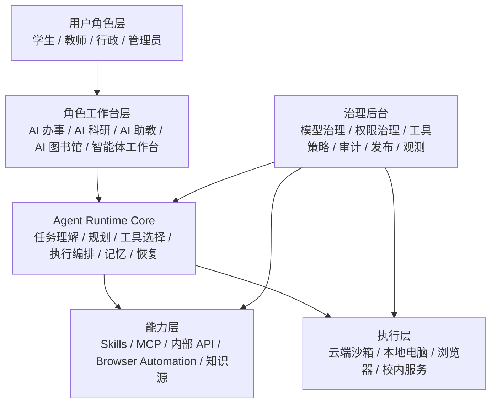
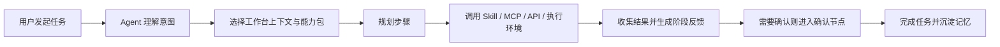
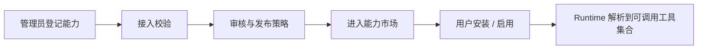
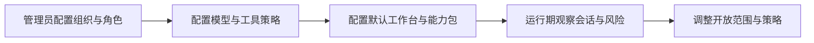

# AI 校园 OS 产品需求文档

版本：v1.0  
日期：2026-04-12  
适用范围：AI 校园 OS 后续产品迭代、架构收敛、前后台边界统一

## 1. 文档目标

本文档用于统一 AI 校园 OS 的下一阶段产品方向，解决当前产品在“Campus OS 外壳、Firefly Agent Runtime、能力市场、后台治理、业务系统接入”多线并行推进下产生的边界模糊问题。

本文档不是单纯的愿景描述，而是基于当前已开发出的本地原型，明确：

- 产品最终要做成什么
- 当前原型已经做到什么
- 哪些能力应该保留并继续演进
- 哪些原型实现需要重构为正式产品能力
- 后续迭代应优先投入在哪些方向

## 2. 产品定义

AI 校园 OS 的目标不是做一个通用聊天机器人，也不是做一个简单的校园助手页面。

AI 校园 OS 的目标是：

**构建一个面向校园场景的、可治理的 Agent Operating System。**

该系统以统一的 Agent 内核为中心，接入各类校园业务系统的 Skill、MCP、内部 API 和受控执行环境，通过后台治理能力对模型、工具、权限、执行、记忆、审计和开放范围进行统一管理，并最终以不同角色工作台的方式服务不同校园用户。

一句话定义：

**一个统一 Agent Runtime、可接入多业务系统能力、支持云端与本地执行、且具备 B 端治理后台的校园 AI 操作系统。**

## 3. 当前产品现状总结

当前本地原型已经不再是“聊天页 Demo”，而是一个具备以下雏形的系统：

- Campus OS 风格前台工作台
- Firefly 任务入口与运行时工作台
- 能力市场原型
- 独立后台治理入口
- 消息、审批、课程等校园业务接入
- 运行时会话、任务、事件、checkpoint 持久化

### 3.1 当前原型截图

#### 当前前台 Campus OS 首页

图示说明：

- 前台已经具备 Campus OS 的壳层结构
- 顶部具备能力域导航
- 中间区域已从单聊天框转向任务入口
- 左侧具备任务与活动承接
- 右侧具备课程、待办、服务等校园信息承接

#### 当前 Firefly 工作台

图示说明：

- Firefly 已被抽象为会话与任务入口，而不只是聊天组件
- 已出现最近会话、任务收件箱、执行对照等 runtime 相关元素
- 这说明产品已经自然走向 Agent Runtime 方向

#### 当前能力市场

图示说明：

- 当前已经有管理员审核上架、用户安装启用的前台原型
- Skill 与 MCP 已经被当作统一能力对象进行浏览和安装
- 这是后续“Capability Registry + User Capability + Runtime Resolver”的前身

#### 当前后台总览

图示说明：

- 后台已从用户端页面中独立出来
- 已具备用户管理、接入管理、智能体管理的入口结构
- 产品已经具备 B 端治理后台的正确方向

#### 当前运行观测后台

图示说明：

- 当前系统已经存在服务端运行观测
- 已具备会话、任务、事件、checkpoint 的观测基础
- 这意味着 Agent Runtime 已经超出纯前端交互层

### 3.2 当前现状判断

当前产品的真实阶段应定义为：

**Agent OS 原型期。**

它已经具备：

- 明确的产品方向
- 初步可运行的 Agent Runtime
- 可演示的校园业务接入
- 初步治理后台

它仍然欠缺：

- 统一的产品边界
- 正式的能力注册与发布体系
- 正式的用户权限与组织治理
- 真正可持续的执行环境编排
- 角色化前台的产品闭环

## 4. 核心产品目标

### 4.1 总目标

建设一个统一 Agent 内核驱动的校园 AI 平台，使校园用户可以通过自然语言或任务入口完成复杂事务，而平台侧可以通过后台对 Agent 的能力、策略、权限、执行和审计进行统一治理。

### 4.2 分目标

#### 用户侧目标

- 用户不需要理解底层 Skill、MCP、API、沙箱、本地执行区别
- 用户只需要表达任务目标，系统自动完成规划与执行
- 不同角色进入的是不同工作台，而不是同一套页面
- Agent 能持续承接任务，而不是一次性回答

#### 平台侧目标

- 平台可以统一接入校园业务系统能力
- 平台可以统一管理模型、工具、执行环境和开放范围
- 平台可以限制 Agent 在不同角色和不同组织下的行为边界
- 平台可以审计 Agent 的规划、调用、执行和结果

#### 学校管理侧目标

- 学校可以决定什么能力可以开放
- 学校可以决定哪些人群可以使用哪些 Agent 或能力
- 学校可以追踪 Agent 的使用情况、风险和价值
- 学校可以逐步将更多业务系统纳入统一 AI 工作台

## 5. 目标产品架构

### 5.1 五个核心产品对象

后续所有页面、流程和能力都应围绕这五个核心对象展开：

- `Agent Runtime`
- `Capability Registry`
- `Execution Fabric`
- `Policy / Permission`
- `Workspace / Role`

这五个对象是后续产品设计的一级对象，不应该再继续扩散成很多平级中心页面。

## 6. 产品设计原则

### 6.1 统一内核，不做多个孤立 Agent

产品应采用统一 Agent 内核。

面向不同用户和场景时，不应默认拆成多个相互独立的 Agent 系统，而应使用：

- 同一套 Runtime Core
- 不同角色工作台
- 不同能力包
- 不同策略配置

### 6.2 能力接入不是主产品，能力治理才是主产品

Skill、MCP、内部 API、浏览器自动化都只是能力来源。

真正的产品核心不是“接了多少工具”，而是：

- 如何统一注册
- 如何统一开放
- 如何统一授权
- 如何统一治理
- 如何统一审计

### 6.3 前后台必须分离

用户端只负责体验与任务完成。

后台负责：

- 能力治理
- 模型治理
- 组织权限
- 运行观测
- 发布审核
- 风险控制

前后台不应继续混在同一产品视角中。

### 6.4 任务导向优先于对话导向

用户真正要完成的是校园任务，不是和系统长时间聊天。

因此前台设计要优先支持：

- 发起任务
- 查看执行进展
- 中途确认与审批
- 恢复上次任务
- 追踪结果

而不应继续围绕“一个聊天框是否更像聊天产品”打磨。

### 6.5 执行环境必须可治理

Agent 后续会调用云端沙箱、本地电脑、浏览器和第三方业务系统。

因此执行环境不是工程细节，而是产品能力的一部分，必须可配置、可限制、可追踪。

## 7. 用户角色与核心场景

### 7.1 学生

核心需求：

- 查看和整理消息、通知、课程、待办
- 获得课程学习辅助与阅读辅助
- 处理校园事务入口

典型工作台：

- AI 助学
- AI 图书馆
- 基础 AI 办事

### 7.2 教师

核心需求：

- 课程管理与课程跟进
- 通知归纳、教学提醒、课前课后辅助
- 科研信息收集与结构化摘要

典型工作台：

- AI 助教
- AI 科研
- AI 办事

### 7.3 行政与运营老师

核心需求：

- 审批、待办、事务流转
- 服务大厅、应用入口、通知归总
- 例行简报与定期任务

典型工作台：

- AI 办事
- 专项业务智能体

### 7.4 学校管理员

核心需求：

- 控制模型开放范围
- 控制工具开放范围
- 控制执行环境边界
- 控制发布、审核、上架和默认启用规则
- 查看调用风险、效果与运行状态

典型工作台：

- AI 校园 OS 管理后台

## 8. 核心功能需求

### 8.1 Agent Runtime Core

#### 目标

提供统一的任务理解、规划、执行、恢复与记忆能力。

#### 必须能力

- 支持自然语言任务输入
- 支持多步任务规划
- 支持工具选择与调用
- 支持并行任务分发
- 支持部分完成
- 支持 checkpoint
- 支持任务恢复
- 支持结果汇总与结构化输出
- 支持任务级记忆与偏好记忆

#### 当前基础

- 已具备 tool registry
- 已具备 planner / executor
- 已具备 SSE 事件流
- 已具备本地 runtime 持久化
- 已具备 checkpoint 与部分完成

#### 下一阶段要求

- 从“继续对话”升级为“回到原工作面继续执行”
- 从“单次任务级记忆”升级为“用户长期任务记忆”
- 从“局部并行工具调用”升级为“受控的多 worker / 多执行环境调度”

### 8.2 Capability Registry

#### 目标

将 Skill、MCP、内部服务、浏览器能力统一抽象成可注册、可发布、可治理的能力对象。

#### 必须能力

- 能力定义注册
- 版本管理
- 审核与上架状态
- 能力元数据管理
- 依赖与接入校验
- 用户安装与启停
- Firefly 运行时能力解析

#### 当前基础

- 已有能力市场前台原型
- 已有 Skill / MCP 目录
- 已有用户安装启用原型

#### 下一阶段要求

- 将当前本地 mock 能力市场重构为三层体系：
  - Admin Capability Registry
  - User Capability Service
  - Runtime Capability Resolver

### 8.3 Execution Fabric

#### 目标

支持 Agent 按任务性质选择合适的执行环境。

#### 执行环境类型

- 云端沙箱
- 本地电脑
- 浏览器执行环境
- 校内部署服务
- 外部业务系统 API

#### 必须能力

- 为每个能力声明执行环境要求
- 为每个用户或组织配置可用执行环境
- 支持人工确认的高风险动作
- 支持本地与云端任务边界控制
- 记录每次执行的环境、输入、输出和风险标签

#### 当前基础

- 当前代码层已经隐含出现浏览器、服务端、业务 API 多种执行方式

#### 下一阶段要求

- 把“工具能不能跑”提升为正式产品配置能力
- 形成统一执行调度与权限隔离策略

### 8.4 Governance Admin

#### 目标

构建 B 端产品真正的管理后台。

#### 一级模块

- 组织与用户管理
- 能力接入管理
- Agent 配置管理
- 模型治理
- 工具策略治理
- 运行观测
- 发布审核
- 审计与报表

#### 必须能力

- 配置默认模型和可选模型
- 配置工具白名单和能力开放范围
- 配置不同角色的默认工作台与默认能力
- 配置是否允许联网、深度研究、本地执行
- 配置需要人工确认的动作类型
- 查看运行会话、任务、事件、失败原因
- 查看能力上架、启停、安装使用数据

#### 当前基础

- 已有后台总览
- 已有接入管理
- 已有运行观测
- 已有部分模型与工具策略配置

#### 下一阶段要求

- 后台从本地文件配置升级为正式后端治理服务
- 加入组织与角色体系
- 加入发布审核流
- 加入审计报表

### 8.5 Role-based Workspaces

#### 目标

用同一个 Agent 内核服务不同角色，而不是给所有人同一个入口。

#### 工作台建议

- AI 办事
- AI 科研
- AI 助教
- AI 图书馆
- AI 智能体 / Firefly 工作台

#### 必须能力

- 角色决定默认工作台集合
- 工作台决定默认能力包与任务模板
- 角色决定默认权限边界
- 用户可在授权范围内切换和扩展能力

#### 当前基础

- 已有能力域导航与多入口雏形

#### 下一阶段要求

- 每个工作台需要明确“任务类型、能力包、目标用户、核心指标”
- 减少“同一前台承载所有概念”的混乱感

## 9. 关键业务流程

### 9.1 用户任务完成流程

### 9.2 能力上架流程

### 9.3 管理后台治理流程

## 10. 非功能需求

### 10.1 安全与权限

- 必须支持按组织、角色、用户控制能力开放范围
- 必须支持高风险动作二次确认
- 必须支持外部系统凭证与连接器隔离
- 必须支持审计日志保留

### 10.2 可靠性

- 任务执行失败时必须支持部分完成
- 外部系统失败时必须支持降级
- 关键任务必须支持 checkpoint 与恢复

### 10.3 可观测性

- 必须记录会话、任务、步骤、工具调用、错误与恢复事件
- 必须支持后台查看最近运行情况

### 10.4 可扩展性

- Agent 内核可替换
- 能力来源可扩展
- 执行环境可扩展
- 工作台可扩展

## 11. 当前版本中不应继续模糊推进的事项

以下事项不应继续以“边做边堆页面”的方式推进，而应在产品定义下收敛：

- 不应继续把能力市场当作单一前台页面打磨
- 不应继续把后台治理混入普通用户页面
- 不应继续把 Skill、MCP、内部 API 当作彼此平级的前台概念暴露给终端用户
- 不应继续把“继续上次任务”停留在聊天续写层面
- 不应继续只关注页面美化而忽略核心对象边界

## 12. 迭代优先级建议

### P0：统一产品骨架

目标：

- 明确五个核心对象
- 明确前后台边界
- 明确能力层与执行层边界

交付：

- 产品定义统一
- 页面导航统一
- 核心名词统一

### P1：补齐 Runtime 闭环

目标：

- 从任务发起到任务完成形成真正闭环

重点：

- 真正的任务恢复
- 工作面恢复
- 人工确认节点
- 多执行环境编排

### P2：重构能力市场为正式能力体系

目标：

- 将当前能力市场原型升级为正式能力治理体系

重点：

- Registry
- User Install
- Runtime Resolver

### P3：补齐后台治理

目标：

- 将后台从本地配置面板升级为学校级治理后台

重点：

- 组织与角色
- 发布审核
- 运行报表
- 风险审计

### P4：角色化工作台产品化

目标：

- 让学生、教师、行政看到真正不同的工作台

重点：

- AI 办事
- AI 科研
- AI 助教
- AI 图书馆

## 13. 版本路线建议

### V1：Agent OS 原型收敛版

目标：

- 统一内核
- 统一能力对象
- 统一后台结构
- 跑通核心任务闭环

### V2：学校治理版

目标：

- 完成组织权限、能力治理、运行观测、发布审核

### V3：多角色正式版

目标：

- 学生、教师、行政、管理员四类工作台稳定上线

### V4：混合执行与自动化版

目标：

- 云端沙箱、本地电脑、浏览器与业务系统形成统一调度与审计体系

## 14. 成功指标

### 用户指标

- 用户任务完成率
- 从任务发起到完成的平均时长
- 重复进入工作台频率
- 用户主动继续上次任务的比例

### 平台指标

- 每个能力的调用量与成功率
- 每个工作台的活跃使用率
- 运行失败原因分布
- 任务恢复成功率

### 管理指标

- 能力上架周期
- 审核通过率
- 高风险调用确认率
- 不同角色权限命中准确率

## 15. 结论

AI 校园 OS 后续不应再被理解为“校园聊天产品继续加功能”。

它的正确方向是：

**以统一 Agent Runtime 为核心，以业务能力接入为供给层，以执行环境编排为执行层，以治理后台为控制层，以角色工作台为用户层，最终构建一个面向校园场景的 Agent Operating System。**

从当前原型出发，最重要的事情不是再堆更多页面，而是：

- 收敛产品骨架
- 固化核心对象
- 明确前后台边界
- 把已经出现的 runtime 与治理能力正式产品化

这份文档将作为后续产品迭代和工程收敛的方向基线。
